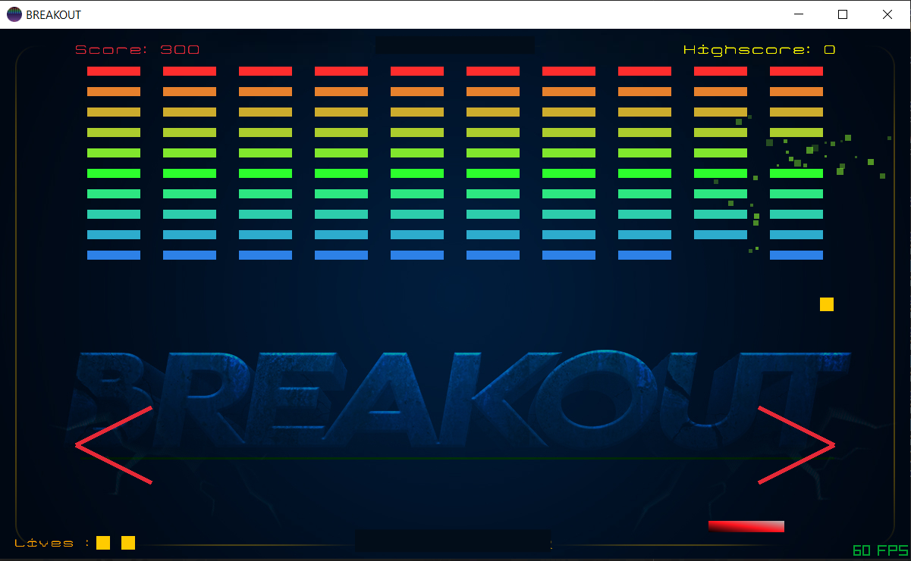

# BREAKOUT GAME IN C++ USING RAYLIB

 Breakout is an arcade game in which the player controls a paddle on the screen knocking the ball back and forth breaking the bricks.
 
 

## BREAKOUT GAME PREVIEW
https://github.com/user-attachments/assets/e1661713-ae2a-49df-8581-eef9327c1f49

## DESCRIPTION
 A player moves the paddle back and forth horizontally to hit and ricochet the ball to cause it to break the bricks on top of the screen.
 If the ball reaches the bottom of the screen it costs one life.
 The bricks are in color of yellow, green, orange, and red from bottom to top.

## VISIT WEBSITE TO DOWNLOAD FOR ANDROID
Download Breakout for android: [BREAKOUT APK](https://abhikumar45444.github.io/Breakout-App/).

## PLAY GAME ON WEB
Checkout Game Here: [BREAKOUT](https://abhikumar45444.github.io/BREAKOUT/).

## PLAY (WINDOWS - EXE)
 Run the [breakout.exe](./build) file.

## BUILD: If you want to make changes feel free to do so
***
Open Makefile
Make necessary adjustments like Compiler for raylib c++ <code>[raylib github windows setup](https://github.com/raysan5/raylib/wiki/Working-on-Windows)</code>.</br>
You can find raylib library in <code>[library folder](./lib)</code> or else you need to compile the library by yourself.
***

## DEPENDENCIES
```console
raylib
opengl32 
gdi32 
winmm
```

## HOW-TO-PLAY
##### Desktop and Web
|keys|description|
|---|---|
|Player|
|<kbd>←</kbd>/<kbd>→</kbd>|move Paddle LEFT/RIGHT|
|<kbd>SPACE</kbd>|Pause/Play|

##### Android
|Gesture|description|
|---|---|
|Player|
|<kbd>←</kbd>/<kbd>→</kbd>|Swipe <em><b>LEFT</b></em> to move Paddle LEFT  or Swipe <em><b>RIGHT</b></em> to move Paddle RIGHT|
|<kbd>↑</kbd>/<kbd>↓</kbd>|swipe <em><b>UP</b></em> to <em><b>Start</b></em> the Game / swipe <em><b>DOWN</b></em> to <em><b>PAUSE/PLAY</b></em> the Game|

## REFERENCES
[Collision Detection - Axis Aligned Bounding Box (AABB)](https://medium.com/@hemalatha.psna/collision-detection-in-javascript-efafe8bba2c0) </br>
[Breakout Game Wiki](https://en.wikipedia.org/wiki/Breakout_(video_game)) </br>
[sRGB](https://en.wikipedia.org/wiki/SRGB#:~:text=sRGB%20is%20a%20standard%20RGB,%2D2%2D1%3A1999.) </br>
[sRGB to Linear and vice-versa Conversion Reference](https://github.com/nothings/stb/blob/master/deprecated/stb_image_resize.h)